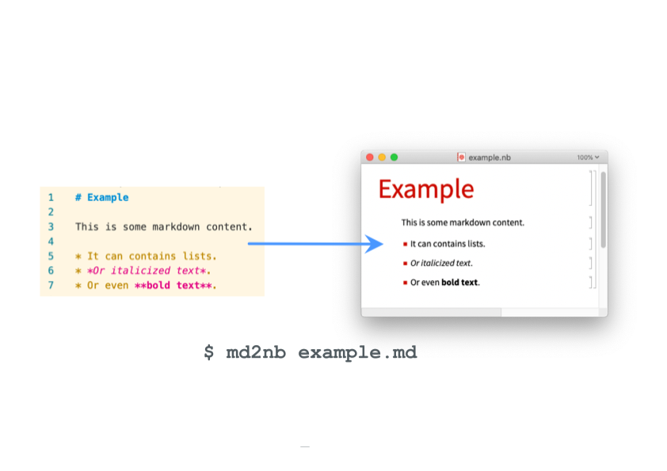

# md2nb

[](https://crates.io/crates/md2nb)


`md2nb` is a command-line tool for converting [Markdown](https://wikipedia.org/wiki/Markdown)
files into [Wolfram Notebooks](https://wolfram.com/notebooks).



## Usage

`md2nb` is a command-line tool. After [installing `md2nb`](#installation), it can be used
to convert a `.md` file to a `.nb`:

```shell
$ md2nb <INPUT>.md <OUTPUT>.nb
```

For example, to convert this project's `README.md` file into a Wolfram Notebook, execute:

```shell
$ md2nb README.md README.nb
```

## Features

`md2nb` converts `.md` files into Wolfram `.nb` files.

Markdown constructs are converted into corresponding standard Wolfram Notebook
representations.

Most CommonMark features are supported, including:

* Text styles like emphasis and italics
* Links
* Headers
* Bulleted lists
* Code blocks
* Block quotes
* Tables
* Horizontal rules

Additionally, some Markdown features are converted into Wolfram Notebook representations
that are more interactive than typical rendered Markdown:

* Code blocks containing code written in a language supported by
  [`ExternalEvaluate`][ExternalEvaluate] will be converted to external language cells,
  which can be executed directly within the Wolfram Notebook.

[ExternalEvaluate]: https://reference.wolfram.com/language/ref/ExternalEvaluate.html

## Examples

See the 'Kitchen Sink' example, which includes samples of all Markdown features
currently supported by `md2nb`.

* [kitchen-sink.md markdown file](./docs/examples/kitchen-sink.md)
* [Screenshot of kitchen-sink.nb](./docs/images/kitchen-sink.png)

## Installation

*TODO*

## License

Licensed under either of

  * Apache License, Version 2.0
    ([LICENSE-APACHE](./LICENSE-APACHE) or http://www.apache.org/licenses/LICENSE-2.0)
  * MIT license
    ([LICENSE-MIT](./LICENSE-MIT) or http://opensource.org/licenses/MIT)

at your option.

## Contribution

Unless you explicitly state otherwise, any contribution intentionally submitted
for inclusion in the work by you, as defined in the Apache-2.0 license, shall be
dual licensed as above, without any additional terms or conditions.